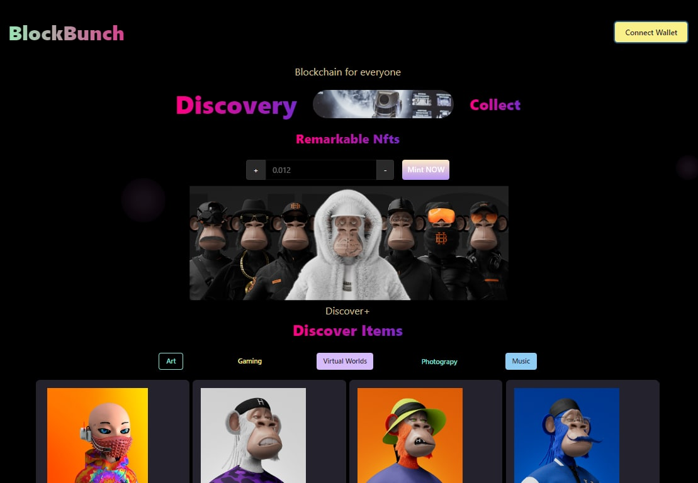

# Dev Apes DApp
---
### winner ethSafari Hackathon (coinbase and IPFS pool Prize)
---

## Description

This is an NFT minting application that rewards the collectors with native [myToken](https://rinkeby.etherscan.io/address/0x8d45908176da1CF4222EaB88a5354A3AdD9a01A6). Funds raised from the sell of the nfts shall be used towards the education of more web3 developers in Uganda.

The concept here is to distribute native tokens to the people who mint nfts. in so doing we shall also be adding value to our own tokens through distribution and adoption but also gain funds from the minting opf our NFT collection.
UI design by [Yaroslav Hrynov](<https://www.figma.com/file/ttsBqNIpga16xFGVTzJAgv/NFT-project-(Community)?node-id=2%3A2>)

## Technologies Used

- IPFS and File coin through [nft.storage](https://nft.storage) and [Moralis IPFS Storage](https://moralis.io/what-is-ipfs-interplanetary-file-system/)
- [Chainlink VRF-Cordinator ](https://github.com/smartcontractkit/chainlink/blob/develop/contracts/src/v0.8/interfaces/AggregatorV3Interface.sol)
- [CoinBase wallet](https://docs.cloud.coinbase.com/wallet-sdk/docs/initializing) connection
- [OpenZeppelin Defender](https://defender.openzeppelin.com)
- [useDapps](https://usedapp-docs.netlify.app/docs/)
- [ethersjs](https://docs.ethers.io/v5/)

## TODO

- add Utility to the NFTS
- create a community on the social platforms
- beautify the site

## Live Demo

Checkout the Live Demo Of the Project Hear [DevApes](https://still-sound-3479.on.fleek.co/)

## Usage

### Requirements

1. Install the Metamask wallet, coinBase wallet
2. Create a wallet.
3. get some [Rinkeby Faucet](https://rinkebyfaucet.com/) and get tokens for the alfajores testnet.
4. Mint your NFT
5. Add [MyTokenAddress](https://rinkeby.etherscan.io/address/0x8d45908176da1CF4222EaB88a5354A3AdD9a01A6)to your Tokens
6. You should recieve an airdrop of 10 [MyTokens](https://rinkeby.etherscan.io/address/0x8d45908176da1CF4222EaB88a5354A3AdD9a01A6)

# Getting Started with Create React App

This project was bootstrapped with [Create React App](https://github.com/facebook/create-react-app).

## Available Scripts

In the project directory, you can run:

### `npm start`

Runs the app in the development mode.\
Open [http://localhost:3000](http://localhost:3000) to view it in your browser.

The page will reload when you make changes.\
You may also see any lint errors in the console.

### `npm test`

Launches the test runner in the interactive watch mode.\
See the section about [running tests](https://facebook.github.io/create-react-app/docs/running-tests) for more information.

### `npm run build`

Builds the app for production to the `build` folder.\
It correctly bundles React in production mode and optimizes the build for the best performance.

The build is minified and the filenames include the hashes.\
Your app is ready to be deployed!

See the section about [deployment](https://facebook.github.io/create-react-app/docs/deployment) for more information.

### `npm run eject`

**Note: this is a one-way operation. Once you `eject`, you can't go back!**

If you aren't satisfied with the build tool and configuration choices, you can `eject` at any time. This command will remove the single build dependency from your project.

Instead, it will copy all the configuration files and the transitive dependencies (webpack, Babel, ESLint, etc) right into your project so you have full control over them. All of the commands except `eject` will still work, but they will point to the copied scripts so you can tweak them. At this point you're on your own.

You don't have to ever use `eject`. The curated feature set is suitable for small and middle deployments, and you shouldn't feel obligated to use this feature. However we understand that this tool wouldn't be useful if you couldn't customize it when you are ready for it.

## Learn More

You can learn more in the [Create React App documentation](https://facebook.github.io/create-react-app/docs/getting-started).

To learn React, check out the [React documentation](https://reactjs.org/).

### Code Splitting

This section has moved here: [https://facebook.github.io/create-react-app/docs/code-splitting](https://facebook.github.io/create-react-app/docs/code-splitting)

### Analyzing the Bundle Size

This section has moved here: [https://facebook.github.io/create-react-app/docs/analyzing-the-bundle-size](https://facebook.github.io/create-react-app/docs/analyzing-the-bundle-size)

### Making a Progressive Web App

This section has moved here: [https://facebook.github.io/create-react-app/docs/making-a-progressive-web-app](https://facebook.github.io/create-react-app/docs/making-a-progressive-web-app)

### Advanced Configuration

This section has moved here: [https://facebook.github.io/create-react-app/docs/advanced-configuration](https://facebook.github.io/create-react-app/docs/advanced-configuration)

### Deployment

This section has moved here: [https://facebook.github.io/create-react-app/docs/deployment](https://facebook.github.io/create-react-app/docs/deployment)

### `npm run build` fails to minify

This section has moved here: [https://facebook.github.io/create-react-app/docs/troubleshooting#npm-run-build-fails-to-minify](https://facebook.github.io/create-react-app/docs/troubleshooting#npm-run-build-fails-to-minify)
